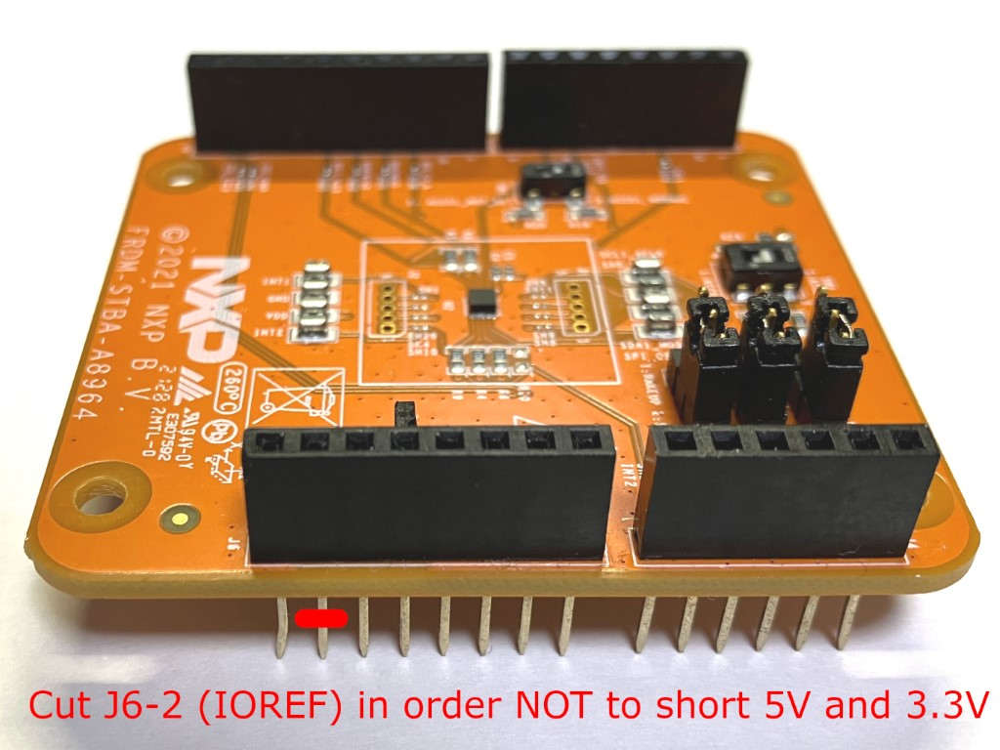

# FXLS89xx_Arduino
This library enables the developer to evaluate NXP FXLS89xx with Arduino.

> **Warning**  
> _**Caution when using library:**_  
> Make sure that **J6-2 MUST NOT be connected** when you use this library.  
> Since the IOREF pin on Arduino is supplied by 5V, **shorting IOREF (5V) and +3V3 (3.3V) can cause either FXLS89xx board or Arduino board damaged.**  
> This driver offers all functions by only I2C communication because all Arduino output H signal is 5V.
> 

## Functions
Please take a look at the example (example_EXT_TRIG).  
Call `FXLS89xx_I2C_Initialize()` function first before using any functions in this library. For using EXT_TRIG mode, call `FXLS89xx_I2C_EXT_TRIG_Init()` after the initialization function.  

```cpp:examples/example_EXT_TRIG/example_EXT_TRIG.ino
/* *** examples/example_EXT_TRIG/example_EXT_TRIG.ino *** */
void setup() {
  // put your setup code here, to run once:
  // Initialize the device and take the WHO_AM_I parameter
  Serial.begin(9600);
  uint8_t whoami=0;
  int16_t stat = FXLS89xx_I2C_Initialize(I2C_ADDR, &whoami);
  ...
  stat = FXLS89xx_I2C_EXT_TRIG_Init(I2C_ADDR);
}

```

Any I2C read and write can be done by `FXLS89xx_I2C_Read()` and `FXLS89xx_I2C_Write_Single()`. 

```cpp:FXLS89xx_Arduino.cpp
/* *** FXLS89xx_Arduino.cpp *** */
int16_t FXLS89xx_I2C_Initialize(uint8_t sAddress, uint8_t *whoami) {
  ...
  uint8_t stat = FXLS89xx_I2C_Write_Single(sAddress, FXLS896x_SENS_CONFIG1, FXLS896x_SENS_CONFIG1_RST_RST, 0);
  ..
  stat = FXLS89xx_I2C_Read(sAddress, FXLS896x_WHO_AM_I, 1, &reg);
```

If you would like to write multiple bytes to the device, then you can use `FXLS89xx_I2C_Write()`.  
The function needs a pointer to registerwritelist_t, which is the list of the same argument of `FXLS89xx_I2C_Write_Single` {writeTo: register address, value: register value, mask: put bits you would like to mask. 
0 to ignore the mask}. Make sure that registerwritelist_t structure should have `__END_WRITE_DATA__` on the last item whose writeTo=0xFFFF indicates the list end.

```cpp:FXLS89xx_Arduino.cpp
/* *** FXLS89xx_Arduino.cpp *** */
int16_t FXLS89xx_I2C_EXT_TRIG_Init(uint8_t sAddress) {
  registerwritelist_t pRegWriteList[] = {
    {FXLS896x_SENS_CONFIG1, 0, ~FXLS896x_SENS_CONFIG1_ACTIVE_MASK},
    {FXLS896x_INT_EN, FXLS896x_INT_EN_DRDY_EN_EN, ~FXLS896x_INT_EN_DRDY_EN_MASK},
    {FXLS896x_SENS_CONFIG4, FXLS896x_SENS_CONFIG4_EXT_TRIG_M_MULTIPLE | FXLS896x_SENS_CONFIG4_INT2_FUNC_EXT_TRIG | FXLS896x_SENS_CONFIG4_INT_POL_ACT_HIGH, 0},
    __END_WRITE_DATA__};
  int16_t stat = FXLS89xx_I2C_Write(sAddress, pRegWriteList);
  ...
```

## Datasheet and Board Information
Device Information|Datasheet|Board Information
---|---|---
[FXLS8964AF](https://www.nxp.jp/products/sensors/accelerometers/2g-4g-8g-16g-low-power-12-bit-digital-accelerometer:FXLS8964AF)	|[FXLS8964AF.pdf](https://www.nxp.jp/docs/en/data-sheet/FXLS8964AF.pdf)	|[FRDM-STBA-A8964](https://www.nxp.jp/design/software/development-software/sensor-toolbox-sensor-development-ecosystem/sensor-toolbox-development-board-for-fxls8964af-3-axis-accelerometer:FRDM-STBA-A8964)
[FXLS8967AF](https://www.nxp.jp/products/sensors/accelerometers/2g-4g-8g-16g-low-power-12-bit-digital-accelerometer:FXLS8967AF)	|[FXLS8967AF.pdf](https://www.nxp.jp/docs/en/data-sheet/FXLS8967AF.pdf) |[FRDM-STBA-A8967](https://www.nxp.jp/design/software/development-software/sensor-toolbox-sensor-development-ecosystem/sensor-toolbox-development-board-for-fxls8967af-3-axis-accelerometer:FRDM-STBA-A8967)
[FXLS8974CF](https://www.nxp.jp/products/sensors/accelerometers/2g-4g-8g-16g-low-power-12-bit-digital-iot-accelerometer:FXLS8974CF)	|[FXLS8974CF.pdf](https://www.nxp.jp/docs/en/data-sheet/FXLS8974CF.pdf)	|[FRDM-K22F-A8974](https://www.nxp.jp/design/software/development-software/sensor-toolbox-sensor-development-ecosystem/sensor-toolbox-development-board-for-fxls8974cf-3-axis-iot-accelerometer:FRDM-K22F-A8974)
